<picture>
  <source media="(prefers-color-scheme: dark)" srcset="dark.svg" />
  <source media="(prefers-color-scheme: light)" srcset="light.svg" />
  
</picture>

  
  &nbsp;
  
  &nbsp;
  
  &nbsp;
  

 

  

  

  

<!--START_SECTION:public_repos-->

<!--END_SECTION:public_repos-->
<!--END_SECTION:public_repos-->

## 📖 About Me

<table>
<tr>
<td width="180"><strong>👤 Who Am I</strong></td>
<td>Chandru M</td>
</tr>

<tr>
<td><strong>💼 Role</strong></td>
<td>Backend Developer / Full Stack Developer</td>
</tr>

<tr>
<td><strong>⚡ Tech Stack</strong></td>
<td>React → Spring Boot → MySQL</td>
</tr>

<tr>
<td><strong>🎓 Education</strong></td>
<td>B.E. Computer Science Engineering SRM TRP Engineering College (Expected 2027)</td>
</tr>

<tr>
<td><strong>📍 Location</strong></td>
<td>Tamil Nadu, India</td>
</tr>

<tr>
<td><strong>🎯 Focus</strong></td>
<td>Backend Systems • REST APIs • Scalable Full-Stack Applications</td>
</tr>

<tr>
<td><strong>🚀 Open To</strong></td>
<td>Backend Engineer • Full Stack Developer • Software Engineer Internships / New Grad</td>
</tr>
</table>

 

- 🛠️ Full stack developer with hands-on, production-style experience across the **React → Spring Boot → MySQL** pipeline.
- 🧩 Strong foundation in **Data Structures & Algorithms**, applying efficient problem-solving and clean coding practices.
- 🚀 Passionate about building end-to-end software—from **REST API design** and **database schema** to **responsive UI development**.
- 📐 Currently strengthening skills in **System Design**, **Docker**, **Microservices**, and scalable backend architecture.
- 🎯 Actively seeking opportunities as a **Backend Engineer**, **Full Stack Developer**, or **Software Engineer Intern / New Graduate**.

 

## 🧰 &nbsp;Tech Stack

<table>
<tr><td width="140"><b>Languages</b></td><td>

  

</td></tr>
<tr><td><b>Frontend</b></td><td>

   

</td></tr>
<tr><td><b>Backend & Databases</b></td><td>

   

</td></tr>
<tr><td><b>Cloud, DevOps & Tooling</b></td><td>

      

</td></tr>
</table>

 

## 🤖 &nbsp;Backend & Systems Expertise

| Domain | Proficiency | Details |
|:--|:--:|:--|
| **REST API Design** | `●●●●○` | Building and consuming REST APIs, frontend–backend integration, request/response contract design |
| **Spring Boot** | `●●●●○` | Service layer architecture, JPA/Hibernate, controller‑service‑repository pattern |
| **Authentication & Security** | `●●●○○` | JWT‑based auth flows, currently deepening Spring Security fundamentals |
| **Database Design (MySQL)** | `●●●●○` | Relational schema design, query optimization, CRUD‑heavy application data layers |
| **Full Stack Integration** | `●●●●○` | React front ends wired to Spring Boot / Node.js backends end‑to‑end |
| **System Design** | `●●○○○` | Actively studying scalability patterns, microservices, and containerization with Docker |

 

## 🚀 &nbsp;Featured Projects

<b>&nbsp;🗂️&nbsp; Portfolio CMS</b>

 

> Full-stack content management system for a personal portfolio, with secure authentication, an admin dashboard, project management, resume upload, and dynamic content updates served to a public-facing frontend.

| | |
|:--|:--|
| **Stack** | React&nbsp;·&nbsp;Spring Boot&nbsp;·&nbsp;JWT&nbsp;·&nbsp;MySQL |
| **Architecture** | React SPA → Spring Boot REST API → MySQL persistence layer |
| **Security** | JWT-based authentication guarding admin routes and content-mutation endpoints |
| **Impact** | Centralizes portfolio content management so updates ship without redeploying static frontend code |
| **Repository** | [Chandru9842 GitHub](https://github.com/Chandru9842) |

<b>&nbsp;🤖&nbsp; AI Resume Analyzer</b>

 

> AI-powered analyzer that compares a candidate's resume against a target job description, returning an ATS-style compatibility score, keyword-gap analysis, and improvement suggestions.

| | |
|:--|:--|
| **Stack** | React&nbsp;·&nbsp;Python&nbsp;·&nbsp;REST API |
| **Architecture** | React frontend for upload/results UI → Python API layer performing resume/JD comparison |
| **Features** | ATS scoring, keyword matching, actionable resume feedback |
| **Impact** | Helps job seekers tailor resumes to specific postings before applying |
| **Repository** | [Chandru9842 GitHub](https://github.com/Chandru9842) |

<b>&nbsp;✅&nbsp; Task Manager</b>

 

> Task management application supporting full CRUD operations, user authentication, dashboards, and project-level organization of tasks.

| | |
|:--|:--|
| **Stack** | Spring Boot&nbsp;·&nbsp;React&nbsp;·&nbsp;MySQL |
| **Architecture** | Layered Spring Boot backend (controller → service → repository) with a React dashboard client |
| **Features** | Full CRUD, authenticated sessions, task/project organization views |
| **Impact** | Demonstrates a complete authenticated CRUD application built on the React + Spring Boot + MySQL stack |
| **Repository** | [Chandru9842 GitHub](https://github.com/Chandru9842) |

<b>&nbsp;🌤️&nbsp; Weather Application</b>

 

> Responsive weather application built on a public weather API, displaying real-time conditions through a clean, minimal UI.

| | |
|:--|:--|
| **Stack** | HTML&nbsp;·&nbsp;CSS&nbsp;·&nbsp;JavaScript |
| **Architecture** | Client-side app consuming a public weather REST API |
| **Features** | Real-time condition lookup, responsive layout |
| **Impact** | Practical front-end project demonstrating API consumption and responsive design fundamentals |
| **Repository** | [Chandru9842 GitHub](https://github.com/Chandru9842) |

<b>&nbsp;💼&nbsp; Portfolio / html-portfolio</b>

 

> Personal developer portfolio sites showcasing projects, skills, and resume — foundational front-end work built with core HTML/CSS/Bootstrap.

| | |
|:--|:--|
| **Stack** | HTML&nbsp;·&nbsp;CSS&nbsp;·&nbsp;Bootstrap |
| **Repository** | [Portfolio](https://github.com/Chandru9842/Portfolio)&nbsp;·&nbsp;[html-portfolio](https://github.com/Chandru9842/html-portfolio) |

 

## 💼 &nbsp;Experience

<table>
<tr>
<td>

**Web Development Intern** · Queenbug Technologies
 `Remote`

- Worked on real-world web applications spanning both frontend and backend
- Handled frontend–backend integration and consumed REST APIs in production-style codebases
- Debugged issues in existing codebases and shipped fixes through Git-based workflows
- Collaborated with the team using version control and code review practices
- Focused on writing clear, maintainable, well-structured code

 

     

</td>
</tr>
</table>

 

## 🏆 &nbsp;Achievements

| Recognition | Details |
|:--|:--|
| 🏆&nbsp; Hackathon Winner | Mediathon Hackathon |
| 🧠&nbsp; Problem Solving | 150+ problems solved on LeetCode |
| 📘&nbsp; Problem Solving | 100+ problems solved on GeeksforGeeks |
| 💼&nbsp; Industry Experience | Web Development Internship — Queenbug Technologies |
| 🚀&nbsp; Project Delivery | Multiple full-stack projects built end-to-end (React + Spring Boot + MySQL) |

 

## 📜 &nbsp;Certifications

Certification badges below reflect coursework and platforms Chandru has engaged with. For exact certificate names/IDs, see the <a href="https://github.com/Chandru9842">GitHub profile</a>.

  

 

## 💼 &nbsp;Professional Coding Profiles

<table align="center">
<tr>
<td width="50%" align="center">

</td>

<td width="50%" align="center">

</td>
</tr>

<tr>
<td width="50%" align="center">

</td>

<td width="50%" align="center">

</td>
</tr>

<tr>
<td width="50%" align="center">

</td>

<td width="50%" align="center">

</td>
</tr>
</table>

 

## 🏅 &nbsp;GitHub Milestones

 

## 📈 &nbsp;Contribution Activity

 

## 🐍 &nbsp;Contribution Snake

  <picture>
    <source
      media="(prefers-color-scheme: dark)"
      srcset="https://raw.githubusercontent.com/Chandru9842/Chandru9842/output/github-contribution-grid-snake-dark.svg" />
    <source
      media="(prefers-color-scheme: light)"
      srcset="https://raw.githubusercontent.com/Chandru9842/Chandru9842/output/github-contribution-grid-snake.svg" />
    
  </picture>

 

## ✈️ &nbsp;GitHub Jet Heatmap

  <picture>
    <source
      media="(prefers-color-scheme: dark)"
      srcset="https://raw.githubusercontent.com/Chandru9842/Chandru9842/main/dist/dark.svg" />
    <source
      media="(prefers-color-scheme: light)"
      srcset="https://raw.githubusercontent.com/Chandru9842/Chandru9842/main/dist/light.svg" />
    
  </picture>

 

## 🟡 &nbsp;Pac-Man Contribution Heatmap

  <picture>
    <source
      media="(prefers-color-scheme: dark)"
      srcset="https://raw.githubusercontent.com/Chandru9842/Chandru9842/output/pacman-contribution-graph-dark.svg" />
    <source
      media="(prefers-color-scheme: light)"
      srcset="https://raw.githubusercontent.com/Chandru9842/Chandru9842/output/pacman-contribution-graph.svg" />
    
  </picture>

 

## ♟️ &nbsp;Automated Grandmaster Chessboard

<!-- CHESS:START -->

  <picture>
    <source media="(prefers-color-scheme: dark)" srcset="https://raw.githubusercontent.com/Chandru9842/Chandru9842/main/assets/chess-animated-dark.svg" />
    <source media="(prefers-color-scheme: light)" srcset="https://raw.githubusercontent.com/Chandru9842/Chandru9842/main/assets/chess-animated-light.svg" />
    
  </picture>

<!-- CHESS:END -->

 

## 🏆 &nbsp;GitHub Achievement Badges

  

 

<b>📖 Click to expand Complete Guide & How to Unlock All GitHub Badges</b>

 

### 🎯 Currently Earnable Badges

| Badge | Name | Requirement | Difficulty | Tiers |
| :---: | :--- | :--- | :---: | :--- |
|  | **Quickdraw** | Close an Issue or Pull Request within 5 minutes of opening it | 🟢 Easy | Default |
|  | **Public Sponsor** | Sponsor any GitHub user or organization | 🟢 Easy | Default |
|  | **Pull Shark** | Get 2 Pull Requests merged into repositories | 🟡 Medium | ⭐ 2 PRs &nbsp;•&nbsp; 🥉 16 &nbsp;•&nbsp; 🥈 128 &nbsp;•&nbsp; 🥇 1,024 |
|  | **YOLO** | Merge a Pull Request without a code review | 🟡 Medium | Default |
|  | **Galaxy Brain** | Get 2 accepted answers in GitHub Discussions | 🟡 Medium | ⭐ 2 &nbsp;•&nbsp; 🥉 8 &nbsp;•&nbsp; 🥈 16 &nbsp;•&nbsp; 🥇 32 |
|  | **Pair Extraordinaire** | Be a co-author on a merged Pull Request | 🔴 Hard | ⭐ 1 PR &nbsp;•&nbsp; 🥉 10 &nbsp;•&nbsp; 🥈 24 &nbsp;•&nbsp; 🥇 48 |
|  | **Starstruck** | Get 16 stars on your own repository | 🔴 Hard | ⭐ 16 Stars &nbsp;•&nbsp; 🥉 128 &nbsp;•&nbsp; 🥈 512 &nbsp;•&nbsp; 🥇 4,096 |

 

#### 🔫 Quickdraw
- **Requirement:** Close an Issue or PR within 5 minutes of creating it.
- **Steps to Unlock:**
  1. Open one of your repositories → go to **Issues** → click **New Issue**.
  2. Enter any title and submit the issue.
  3. Immediately click **Close Issue** within 5 minutes.
  *(Can also be earned using a Pull Request).*

#### 💖 Public Sponsor
- **Requirement:** Sponsor any GitHub user or organization.
- **Steps to Unlock:** Visit a GitHub profile with a Sponsor button, select the minimum tier, and complete payment. The badge appears automatically.

#### 🦈 Pull Shark
- **Requirement:** Merge 2 Pull Requests.
- **Steps to Unlock:** Create a new branch, commit a change, push the branch, open a Pull Request, and merge it. Repeat once more. Only merged PRs count.

#### 🤪 YOLO
- **Requirement:** Merge a Pull Request without a code review.
- **Steps to Unlock:** Create a Pull Request in a repository where branch rules do not enforce review, and merge directly.

#### 🧠 Galaxy Brain
- **Requirement:** Receive 2 accepted answers in public GitHub Discussions.
- **Steps to Unlock:** Find repositories with Discussions enabled, answer questions, and have your response marked as the accepted solution.

#### 👥 Pair Extraordinaire
- **Requirement:** Become a co-author on a merged Pull Request.
- **Steps to Unlock:** Add `Co-authored-by: Name <email@example.com>` to the commit message and merge the PR. Both authors receive the achievement.

#### ⭐ Starstruck
- **Requirement:** Receive 16 stars on a repository you own.
- **Steps to Unlock:** Build useful open-source software, write high-quality documentation with visuals, add relevant repository topics, and share your project with the developer community.

 

### ❌ Retired Badges
- ❄️ **Arctic Code Vault Contributor** — Awarded to contributors who had code archived in the 2020 Arctic Vault.
- 🚀 **Mars 2020 Contributor** — Awarded to contributors of open-source projects used in the NASA Mars 2020 mission.

---

### 💡 Tips to Collect Achievements
- Keep your projects open-source and active.
- Participate in GitHub Community discussions.
- Collaborate with fellow developers through co-authored commits.
- Write detailed, well-structured README guides.

 

## ⏱️ &nbsp;WakaTime Developer Activity Dashboard

  <picture>
    <source media="(prefers-color-scheme: dark)" srcset="https://raw.githubusercontent.com/Chandru9842/Chandru9842/main/assets/wakatime-dashboard-dark.svg" />
    <source media="(prefers-color-scheme: light)" srcset="https://raw.githubusercontent.com/Chandru9842/Chandru9842/main/assets/wakatime-dashboard-light.svg" />
    
  </picture>

 

## 🔄 &nbsp;Recent GitHub Activity

<!--START_SECTION:activity-->
- Recent commits, PRs, issues, and releases will appear here automatically once `.github/workflows/recent-activity.yml` runs for the first time.
<!--END_SECTION:activity-->

 

## ✍️ &nbsp;Latest Content

<b>📝 Recent Blog Posts</b>

 

<!--START_SECTION:blog-->
- No blog RSS feed configured yet. Add your feed URL to `BLOG_FEED_LIST` in `.github/workflows/blog-posts.yml` (e.g. a Hashnode, Dev.to, Medium, or Substack feed) to auto-populate this list.
<!--END_SECTION:blog-->

<b>▶️ Latest YouTube Videos</b>

 

No YouTube channel configured yet. To enable, add your channel ID as `YOUTUBE_CHANNEL_ID` and a `YOUTUBE_API_KEY` secret, then re-enable the `youtube` job in `.github/workflows/recent-activity.yml`.

<b>💼 Latest LinkedIn Articles</b>

 

LinkedIn discontinued public RSS/API access for personal article feeds, so there is no reliable automated source for this section. Recommended alternative: manually pin 2–3 article links here, or publish long-form posts on a platform with an open feed (Hashnode/Dev.to/Medium) and cross-post to LinkedIn — those feeds work with the blog-posts workflow above.

 

## 💬 &nbsp;Daily Developer Wisdom

  <picture>
    <source media="(prefers-color-scheme: dark)" srcset="https://raw.githubusercontent.com/Chandru9842/Chandru9842/main/assets/quote-card-dark.svg" />
    <source media="(prefers-color-scheme: light)" srcset="https://raw.githubusercontent.com/Chandru9842/Chandru9842/main/assets/quote-card-light.svg" />
    
  </picture>

 

## 🎯 &nbsp;Current Focus & Objectives

  <picture>
    <source media="(prefers-color-scheme: dark)" srcset="https://raw.githubusercontent.com/Chandru9842/Chandru9842/main/assets/focus-card-dark.svg" />
    <source media="(prefers-color-scheme: light)" srcset="https://raw.githubusercontent.com/Chandru9842/Chandru9842/main/assets/focus-card-light.svg" />
    
  </picture>

 

## 📫 &nbsp;Connect & Collaborate

  <picture>
    <source media="(prefers-color-scheme: dark)" srcset="https://raw.githubusercontent.com/Chandru9842/Chandru9842/main/assets/connect-card-dark.svg" />
    <source media="(prefers-color-scheme: light)" srcset="https://raw.githubusercontent.com/Chandru9842/Chandru9842/main/assets/connect-card-light.svg" />
    
  </picture>

  

🕒 Last Updated: <!--LAST_UPDATED-->2026-08-23 12:18 UTC<!--END_LAST_UPDATED-->

